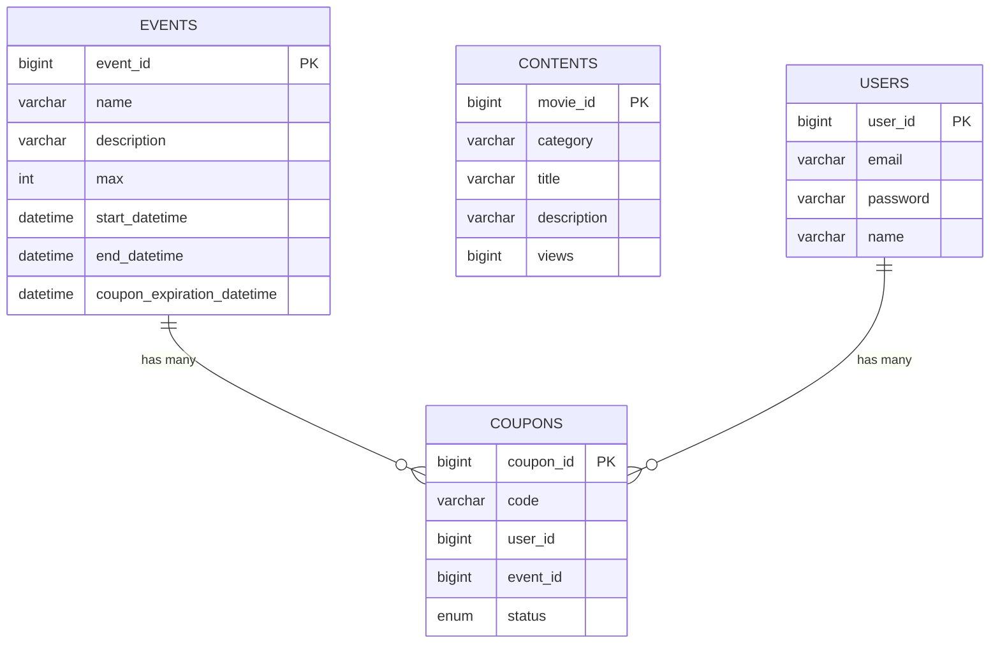

# netplus
 
* 25/01/31 ~ 25/02/07
* [taejunUM](https://github.com/taejunUM), [leesuoho](https://github.com/leesuoho), [Shin-Gaeul](https://github.com/Shin-Gaeul), [cnux9](https://github.com/cnux9)

## 프로젝트 소개

* 이 프로젝트는 넷플릭스와 유사한 콘텐츠 스트리밍 서비스를 모방한 백엔드 애플리케이션입니다.
* Spring Boot를 기반으로 개발되었으며, 사용자 관리, 콘텐츠 관리, 이벤트 및 쿠폰 시스템 등 다양한 기능을
  제공합니다.

## 프로젝트 핵심 목표

* 안정적이고 확장 가능한 콘텐츠 스트리밍 플랫폼 구축
* 효율적인 이벤트 관리 및 쿠폰 시스템 도입
* 높은 동시접속 처리를 위한 성능 최적화

## Key Summary

* 기술 스택: Spring Boot, Spring Security, Spring Data JPA, Redis, MySQL
* 주요 기능: 사용자 인증, 콘텐츠 관리, 검색 기능, 이벤트 및 쿠폰 시스템
* 성능 최적화: 캐싱
* 보안: JWT 기반 인증, 암호화

## 인프라 아키텍처 & 적용기술

* 백엔드: Spring Boot
* 데이터베이스: MySQL (주 데이터 저장), Redis (캐싱 및 세션 관리)
* 컨테이너관리툴: Docker
* ORM: Spring Data JPA
* 인증: Spring Security, JWT
* 빌드 도구: Gradle
* 캐싱: Caffeine (로컬 캐시), Redis (리모트 캐시)
* 테스트: nGrinder를 활용해서 캐시 성능 분석 및 최적화

## 주요 기능

* 사용자 관리:
  회원가입, 로그인, 프로필 관리,
  JWT 기반 인증
* 콘텐츠 관리:
  콘텐츠 CRUD 작업,
  카테고리별 콘텐츠 분류,
  조회수 기반 인기 콘텐츠 추천
* 검색 기능:
  키워드 기반 콘텐츠 검색,
  인기 검색어 랭킹 제공
* 이벤트 및 쿠폰 시스템:
  이벤트 생성 및 관리,
  쿠폰 발급
* 조회수 관리:
  Redis를 활용한 실시간 조회수 집계,
  중복 조회 방지 로직

## 기술적 고도화

* 캐싱 전략:
  Caffeine을 이용한 로컬 캐시 구현,
  Redis를 활용한 리모트 캐시 시스템 구축
* 성능 최적화:
  데이터베이스 인덱싱 및 쿼리 최적화
* 보안 강화:
  Spring Security를 이용한 인증처리,
  비밀번호 암호화
* 확장성 고려:
  컨테이너화를 위한 Docker 지원 준비

## 역할 분담 및 협업 방식

* 백엔드 개발: Spring Boot 기반 API 개발, 데이터베이스 설계
* 인프라 관리: 서버 구성, 데이터베이스 관리, 캐싱 시스템 구축
* 보안 담당: 인증 시스템 구현, 보안 취약점 분석 및 대응
* 성능 최적화: 캐싱 전략 수립, 쿼리 최적화
* 협업 방식: 협업 도구로는 Git을 사용하여 버전 관리를 수행, 코드 컨벤션을 사용하여 통일성 부여

## 성과 및 회고

* 안정적인 백엔드 시스템 구축으로 사용자 경험 향상
* Redis를 활용한 캐싱으로 응답 시간 개선
* JWT 기반 인증 시스템으로 보안성 강화
* 코드 리뷰를 통한 성능 최적화 및 가독성 향상

## ERD

## nGrinder 성능 테스트
* Vuser: 1
* Duration: 3분
* Ramp-Up: 미적용
* 밀리세컨드 단위의 차이이긴 하지만 로컬 캐시 > 리모트 캐시 > 캐시 미적용 순으로 성능이 좋은 것을 확인할 수 있음

### 캐시 미적용

* TPS: 52.3
* Mean Test Time: 18.94 MS
* Successful Tests: 9012
### 로컬 캐시 적용(Caffeine Cache)

* TPS: 141.3
* Mean Test Time: 5.92 MS
* Successful Tests: 24619
### 리모트 캐시 적용(Redis Cache)

* TPS: 123.4
* Mean Test Time: 7.88 MS
* Successful Tests: 20298
